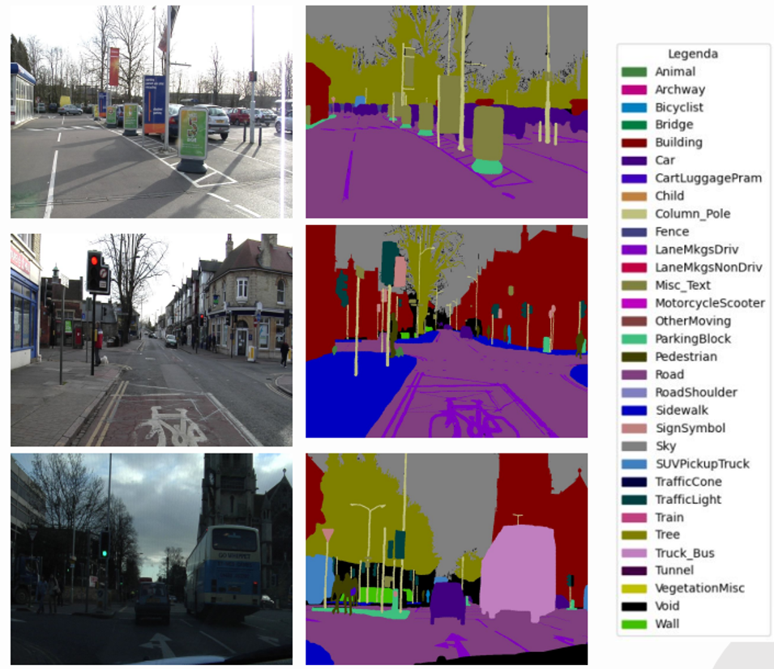
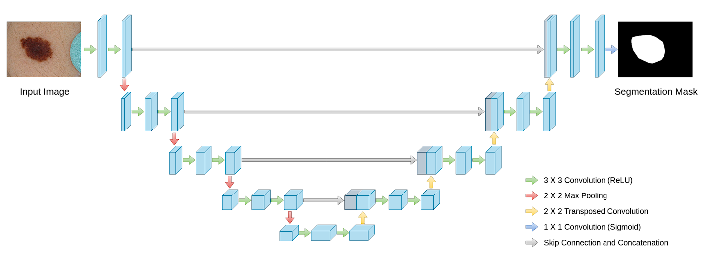
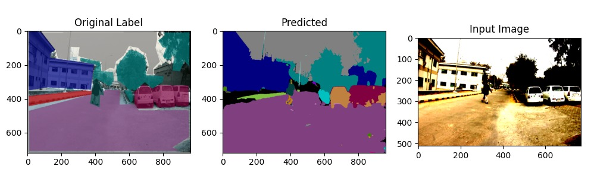

# 🎨🧩 Semantic Segmentation for Autonomous Vehicle


## 📜 Introduction
Semantic segmentation is a crucial computer vision task that assigns a class label to each pixel in an image, enabling precise scene understanding. Specifically, semantic segmentation partitions an image into meaningful segments, where each pixel is classified into a specific category. This project focuses on segmenting urban driving scenes using the CamVid dataset, leveraging deep learning techniques for enhanced accuracy. By utilizing the U-Net architecture, the model efficiently captures both spatial and contextual information, ensuring high-quality segmentation results. Advanced training strategies and data augmentation further improve robustness and generalization. It is widely applied in autonomous driving for object recognition and medical imaging for detecting anomalies.


**_Figure-01:Semantic Segmentation_**


### 🎯 Goal
The primary objective is to assign each pixel in an image a class label, effectively understanding the scene at a granular level.

---
## 📂 CamVid Dataset Overview
- **Origin**: Extracted from videos, providing pixel-wise annotations for urban driving scenes.
- **Classes**: 32 different classes (cars, pedestrians, trees, roads, etc.).
- **Total Images**: 701 labeled frames.
- **Resolution**: 720×960 pixels.

📷 **Example of CamVid Dataset:**



**_Figure-2:Original Image & Labeled Image with classes_** 

## 🔄 Data Augmentation Process

### 📹 Custom Video Creation
- A custom video was recorded under various lighting and traffic conditions.

### 📸 Frame Extraction
- Frames were extracted at **1 frame per second** and resized to **720×960 pixels**.

### 🏷️ Annotation
- Frames were manually annotated using **MATLAB Image Labeler**.

### 🗂️ Dataset Integration
- Custom images were added to CamVid, ensuring a balanced dataset split.

---
## 🏗️ Model Details

### 🗼 U-Net Architecture
U-Net is a powerful **encoder-decoder CNN** for segmentation tasks. It captures both spatial and contextual features using:
- **Encoder**: Downsampling layers extract deep features.
- **Decoder**: Upsampling layers reconstruct spatial details.
- **Skip Connections**: Preserve fine details for improved segmentation accuracy.

🔍 **U-Net Structure:**



**_Figure-3: Visual Atchitecture of U-Net_** 

---
## ⚙️ Training Details

### 🔧 Hyperparameters and Settings

| Parameter             | Value    |
|----------------------|---------|
| **Batch Size**       | 16      |
| **Epochs**          | 100     |
| **Optimizer**       | Adam    |
| **Learning Rate**   | 0.001   |
| **Loss Function**   | Categorical Crossentropy |

### 📌 Callbacks

| Callback            | Description |
|--------------------|-------------|
| **EarlyStopping**  | Patience of 20 on validation mean IoU |
| **ModelCheckpoint** | Save the best model based on validation mean IoU |
| **CSVLogger**      | Log metrics |
| **ReduceLROnPlateau** | Reduce learning rate by a factor of 0.1 when validation loss plateaus |


## 🔗 Methadology
### 🔧 Configuration Code
```python
# Training settings
image_width = 768
image_height = 512
batch_size = 4
init_lr = 1e-3
backbone = 'efficientnetb2'
```

### 🔳 Model Initialization
```python
import segmentation_models as sm

def create_model():
    model = sm.Unet(backbone_name='efficientnetb2',
                    input_shape=(image_height, image_width, 3),
                    classes=32,
                    activation='softmax',
                    encoder_weights='imagenet')
    return model

model = create_model()
```

### 🧱 Training Execution
```python
model.compile(optimizer=tf.keras.optimizers.RMSprop(lr=init_lr),
              loss=tf.keras.losses.categorical_crossentropy,
              metrics=[tf.keras.metrics.categorical_accuracy])

hist = model.fit(data_gen_train,
                 epochs=85,
                 validation_data=data_gen_valid,
                 callbacks=[save_model, csv_logger, early_stopping, reduce_lr])
```

---
## 🧪 Evaluation and Testing

### 📊 Model Evaluation
```python
res_train = model.evaluate(data_gen_train)
res_test = model.evaluate(data_gen_valid)
print(f'Training Accuracy: {res_train[1]:.4f}')
print(f'Validation Accuracy: {res_test[1]:.4f}')
```

### 🖼️ Prediction on Custom Image
```python
img = cv.imread('data/train/05.png')
img = cv.resize(img, (image_width, image_height))
y_out = model.predict(preprocessing(np.expand_dims(img, axis=0)))
prediction = np.argmax(y_out, axis=3)[0]
```

### 🎨 Visualization of Results


  
 
**_Figure-4: Original Label , Predicted output and Input Image_**

---
## 📌 Results
- **Training Accuracy:** 🔼 **90%** after 85 epochs.
- **Training Loss:** 🔽 Decreasing steadily.
- **Segmentation Quality:** Demonstrates precise pixel-wise classification.

---
## 🏁 Conclusion
The **U-Net model** demonstrated exceptional performance in segmenting urban driving scenes with **high accuracy**, effectively distinguishing between various objects in complex environments. The model's capability to preserve fine details through **skip connections** enhances segmentation quality, making it well-suited for real-world applications. Future work could focus on **hyperparameter tuning** to optimize performance, exploring **more advanced architectures** like Transformer-based models, and integrating the system into **autonomous driving frameworks** for real-time scene understanding and navigation.

---
## 🚀 Installation & Usage
### 📥 Clone Repository
```bash
git clone https://github.com/ahtisham73/Semantic-Segmentation-for-Autonomous-Vehicle.git
cd semantic-segmentation-camvid
```
### 📦 Install Dependencies
```bash
pip install -r requirements.txt
```
### ⚙️ Train Model
```bash
python train.py
```
### 🎯 Test Model
```bash
python test.py --image path/to/test_image.png
```

---

## 📝 License
This project is licensed under the **MIT License**.

---

🚀 Contributions are welcome! 
Submit a PR or open an issue to collaborate. Let’s build smarter

---

## 📨 Contact

You can reach me via email at [ahtishamsudheer@gmail.com](mailto:ahtishamsudheer@gmail.com)

---

🌟 **Give this repo a star if you found it useful!** ⭐
